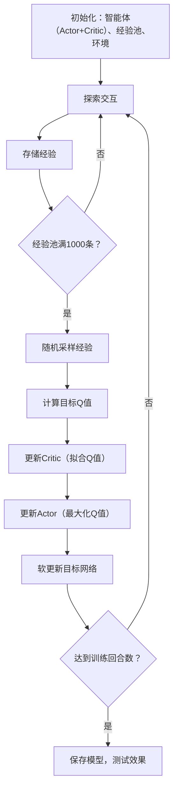

# DDPG强化学习代码深度解析（适合入门）

你提供的这段代码实现了**DDPG（Deep Deterministic Policy Gradient）** 算法，这是强化学习中专门解决**连续动作空间**问题的经典算法（比如控制机械臂的力矩、小车的加速度等）。下面我会从「模块功能」「工作原理」「关键步骤」「输入输出」「设计思路」五个维度，用通俗易懂的语言帮你拆解清楚。

## 一、整体功能概述
DDPG的核心目标是训练一个「智能体（Agent）」，让它在与环境的交互中学会「做决策」——比如在`Pendulum-v1`环境中（默认环境），智能体需要控制一根倒立的摆，通过输出连续的「力矩」动作，让摆保持竖直平衡（奖励越高说明平衡得越好）。

这段代码是**端到端的完整实现**：从与环境交互收集数据，到训练核心的「演员-评论家」网络，再到保存模型、测试效果，形成了闭环。

## 二、核心功能模块解析
代码按「辅助工具→核心组件→整合逻辑→应用流程」分层，每个模块各司其职，又相互配合。

### 1. 核心辅助函数（工具层）
这些是算法的「小助手」，解决训练中的基础问题。

#### （1）`RunningMeanStd` 类 + `normalize` 函数：状态归一化
- **作用**：把环境输出的「状态数据」标准化（比如从`[-10,10]`缩放到`[-1,1]`附近）。
- **为什么需要？** 神经网络对输入的尺度很敏感：如果状态数据的范围差异大（比如一个特征是`0.1`，另一个是`100`），网络很难学出规律。归一化能让训练更稳定、更快。
- **工作逻辑**：
  - `RunningMeanStd`：实时统计状态的「均值」和「标准差」（滑动更新，不会只看当前数据）；
  - `normalize`：用公式 `(x - 均值) / (标准差 + 极小值)` 把数据标准化（加极小值是为了避免标准差为0时除以零报错）。

#### （2）`get_target_updates` 函数：目标网络更新
- **作用**：实现「目标网络」对「主网络」的「软更新」。
- **关键概念**：
  - 「主网络」：实时更新的网络（Actor和Critic），负责选动作、评价值；
  - 「目标网络」：主网络的「稳定副本」，用来计算训练的「目标值」（避免主网络参数波动导致目标值不稳定）。
- **工作逻辑**：
  - 初始化：让目标网络的参数完全等于主网络（`init_updates`）；
  - 软更新：每次训练后，让目标网络参数「缓慢跟进」主网络（`target = (1-tau)*target + tau*main`），`tau`（默认0.001）越小，目标网络越稳定。

### 2. 经验回放池（`Memory` 类）：数据存储与采样
- **作用**：存储智能体与环境交互的「经验数据」，并随机采样供训练使用。
- **核心问题**：强化学习的经验是「时序相关」的（比如第1步的状态和第2步的状态高度相关），如果直接按顺序用这些数据训练，会导致网络学到「时序噪声」，而非真正的规律。
- **工作逻辑**：
  - 存储格式：每条经验是 `(当前状态obs0, 动作action, 奖励reward, 下一状态obs1, 是否结束done)`（像写日记一样记录每一步）；
  - 存储方式：用「循环缓冲区」——当存满时，新数据会覆盖最早的数据（避免内存爆炸）；
  - 采样方式：训练时随机从缓冲区选一批数据（打破时序相关性，模拟「独立同分布」的数据，让网络学通用规律）。

### 3. 动作噪声（`OrnsteinUhlenbeckNoise` 类）：探索机制
- **作用**：让智能体在训练初期「敢尝试不同动作」（即「探索」），而不是一直做固定动作（即「利用」）。
- **为什么连续空间需要这种噪声？**
  - 离散动作空间（比如围棋的落子点）可以用「概率采样」选动作；但连续动作空间（比如力矩`[-2,2]`），直接输出确定性动作会导致探索不足。
- **OU噪声的特点**：
  - 有「时间相关性」：比如这次输出的噪声是`0.5`，下次可能是`0.6`（而不是随机跳变到`-1`），更符合真实物理系统的动作变化（比如机械臂的力矩不会突然剧变）；
  - 会向「均值`mu`」回归：避免噪声越来越大，保证探索不会太离谱。

### 4. 核心网络（Actor + Critic）：智能体的「大脑」
DDPG的核心是「演员-评论家（Actor-Critic）」架构——两个网络分工合作，共同学习最优策略。

#### （1）`Actor` 类：策略网络（演员）
- **角色**：「决策者」——输入「当前状态」，输出「确定性动作」（连续值）。
- **网络结构**（简单的全连接网络）：
  - 输入：环境状态（比如`Pendulum-v1`的状态是3维数组：摆的角度、角速度、角加速度）；
  - 中间层：2层64维的ReLU激活层（提取状态特征）；
  - 输出：动作（用`tanh`激活缩放到`[-1,1]`，再乘「动作边界」得到实际动作范围，比如`[-2,2]`）。
- **核心目标**：输出能让「评论家」打高分的动作。

#### （2）`Critic` 类：价值网络（评论家）
- **角色**：「评分员」——输入「当前状态+动作」，输出「Q值」（这个动作的「好坏程度」：Q值越高，说明这个动作能带来的未来总奖励越多）。
- **网络结构**：
  - 输入：拼接「状态」和「动作」（因为Q值是「状态-动作对」的价值，缺一不可）；
  - 中间层：和Actor一样的2层64维ReLU激活层；
  - 输出：Q值（标量，比如`-50`表示这个动作未来会带来负奖励，`100`表示正奖励）。
- **核心目标**：准确预测动作的实际价值（即拟合「真实Q值」）。

### 5. DDPG核心逻辑（`DDPG` 类）：整合与调度
这个类是「总指挥」，把上面的所有组件串起来，实现算法的核心逻辑。

#### 核心成员与初始化
- 超参数：`gamma`（折扣因子，未来奖励的权重，比如0.99表示「100步后的奖励相当于现在的1步奖励」）、`tau`（目标网络更新系数）等；
- 4个网络：主Actor、主Critic、目标Actor、目标Critic（成对出现，保证训练稳定）；
- 优化器：用Adam优化器分别更新Actor和Critic（学习率不同，Critic通常学得快一些）；
- 会话：TensorFlow的计算入口，负责执行网络计算和参数更新。

#### 关键方法解析
##### （1）`select_action`：选动作（与环境交互用）
- 流程：状态归一化 → 主Actor输出动作 → 训练时加噪声（探索）→ 裁剪动作到合法范围；
- 测试时不加噪声：直接用Actor输出的确定性动作（此时智能体已学会最优策略，不需要探索）。

##### （2）`update`：更新网络（训练核心）
这是DDPG最关键的步骤，分6步实现，每一步都对应算法的核心原理：

1. **采样经验**：从`Memory`中随机拿一批数据（默认64条）；
2. **状态归一化**：把采样到的「当前状态obs0」和「下一状态obs1」标准化；
3. **计算目标Q值（贝尔曼方程）**：  
   这是Critic的「学习目标」，公式为：  
   `目标Q值 = 即时奖励 + gamma × (1 - 是否结束) × 目标Critic的Q值(下一状态, 目标Actor的动作)`  
   - 解释：当前动作的价值 = 现在拿到的奖励 + 未来能拿到的奖励（如果回合结束，未来奖励为0）；
   - 为什么用「目标网络」？因为主网络一直在更新，如果直接用主网络算未来价值，会导致目标值波动太大，训练不稳定。
4. **更新Critic**：  
   用「预测Q值（主Critic输出）」和「目标Q值」的「MSE损失」（均方误差）更新主Critic——让Critic的预测越来越准；
5. **更新Actor**：  
   Actor的损失是「-主Critic的Q值均值」（负号是因为TensorFlow默认做「梯度下降」，而我们要「最大化Q值」，即梯度上升）；  
   解释：让Actor输出的动作，能被Critic打更高的分（相当于「演员」根据「评论家」的评分调整表演）；
6. **软更新目标网络**：  
   让目标Actor和目标Critic的参数缓慢跟进主网络（避免目标网络太旧，跟不上主网络的进步）。

##### （3）`save_model`/`load_model`：模型保存与加载
- 用TensorFlow的`Saver`把网络参数存到文件，测试时直接加载，不用重新训练。

### 6. 训练流程（`train_ddpg` 函数）：端到端训练
这是「把算法落地」的流程，相当于给智能体制定「学习计划」：

1. **初始化环境与组件**：创建`Pendulum-v1`环境，获取状态/动作的维度和边界；初始化DDPG智能体、经验池、动作噪声；
2. **训练循环（按「回合」迭代）**：  
   一个「回合」= 从环境重置开始，到任务结束（比如摆倒下）；  
   每个回合内的步骤：
   - 重置环境和噪声；
   - 循环交互：选动作→执行动作→存经验→更新状态；
   - 经验池满1000条后开始训练（避免初期数据太少，训练不稳定）；
   - 回合结束后记录奖励，打印进度（每10回合打一次日志）；
3. **训练完成**：保存模型，关闭环境。

### 7. 测试流程（`test_ddpg` 函数）：验证效果
训练完后，看看智能体学得怎么样：

1. **加载模型**：初始化DDPG智能体，加载训练好的参数；
2. **测试循环**：
   - 每个回合重置环境，选动作时**不加噪声**（用纯策略）；
   - 调用`env.render()`可视化（能看到摆如何保持平衡）；
   - 记录每个回合的奖励和步数（奖励越高，说明学得越好）；
3. **输出结果**：打印测试分数，关闭环境。

## 三、整体工作流程（关键步骤）
把上面的模块串起来，DDPG的完整工作流可以总结为「4步循环」：

## 四、输入输出说明
以默认的`Pendulum-v1`环境为例，输入输出非常明确：

### 1. 输入数据（环境→智能体）
- **数据类型**：numpy数组（状态）；
- **格式与含义**：3维数组 `[theta, theta_dot, cos(theta)]`  
  （theta：摆与竖直方向的夹角；theta_dot：角速度；cos(theta)：夹角的余弦值）；
- **示例**：`[-0.12, 0.34, 0.99]`（摆稍微向左偏，角速度向右，接近竖直）。

### 2. 输出数据（智能体→环境）
#### （1）训练阶段输出
- **模型文件**：保存到`./ddpg_model`目录，包含网络参数（`.data`文件）、计算图（`.meta`文件）等；
- **训练日志**：控制台打印，格式如下：  
  `回合:  50 | 步数: 200 | 奖励: -1234.5 | 平均奖励: -1567.8 | 耗时: 120.3s`  
  （奖励越接近0，说明摆平衡得越好；`Pendulum-v1`的最大步数是200）。

#### （2）测试阶段输出
- **可视化窗口**：实时显示摆的运动状态（能看到摆从倾斜到平衡的过程）；
- **测试结果**：控制台打印，格式如下：  
  `测试回合 1: 奖励 = -890.1, 步数 = 200`  
  （步数200表示回合正常结束，摆全程保持平衡）。

## 五、设计思路亮点（为什么这么写？）
这段代码的设计非常贴合DDPG的核心思想，新手能通过它理解强化学习的「稳定性设计」和「连续空间适配」：

### 1. 模块化拆分：低耦合，高清晰
每个组件只做一件事：`Memory`管存储，`Actor`管选动作，`Critic`管评分，`DDPG`类管调度。这种设计不仅易读，还方便修改（比如想换噪声类型，只需改`OrnsteinUhlenbeckNoise`类）。

### 2. 稳定性优先：解决强化学习的「训练抖动」问题
DDPG的三大稳定性设计在代码中体现得淋漓尽致：
- **经验回放**：打破数据相关性；
- **目标网络**：固定目标值计算；
- **软更新**：避免目标网络突变。

### 3. 连续空间适配：针对性解决核心痛点
- **确定性动作**：Actor输出连续值，而非离散动作的概率；
- **OU噪声**：符合物理系统的探索机制；
- **动作裁剪**：保证输出的动作在环境允许的范围内（比如力矩不能超过`±2`）。

### 4. 端到端闭环：从训练到测试无缝衔接
代码从「创建环境」到「保存模型」再到「可视化测试」，形成了完整的工作流，新手运行后能直接看到效果，更容易建立「算法→效果」的直观认知。

## 六、小建议（帮你深入理解）
1. **改参数试效果**：比如把`tau`改成0.01（目标网络更新更快），或把`gamma`改成0.9（更看重即时奖励），观察奖励变化；
2. **换环境测试**：把`env_id`改成`MountainCarContinuous-v0`（小车爬山坡），看看智能体能否学会输出连续的加速度；
3. **简化网络结构**：把Actor/Critic的中间层从64维改成32维，观察训练速度和效果的变化（体会网络容量对性能的影响）。

通过这些实践，你能更深刻地理解「超参数」「网络结构」对强化学习算法的影响，这比单纯看代码更有用～