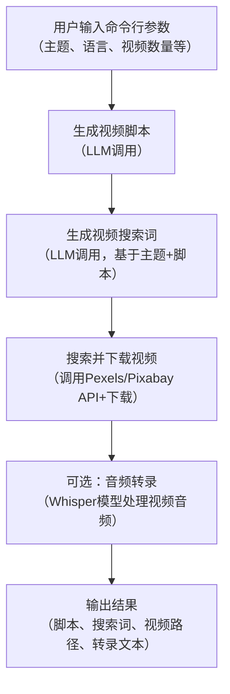

这段代码是一个**自动化视频内容生成工具**，核心能力是从“视频主题”出发，自动完成脚本撰写、素材搜索、视频下载，还附带了音频转文字的示例功能。它把“创意→素材”的流程拆分成多个可复用模块，非常适合快速制作简单视频的场景。

## 一、核心功能模块解析
代码采用**模块化设计**，每个模块负责一个独立任务，模块间通过“数据传递”衔接（比如脚本生成的结果会传给搜索词生成模块）。以下是8个核心模块的详细说明：

### 1. 配置管理模块（Config类）
**功能**：统一管理工具的所有配置（比如API密钥、模型参数、代理设置），避免硬编码（写死在代码里）。  
**工作原理**：
1. 初始化时先找到代码文件所在的文件夹（`root_dir`），定位配置文件（`config.toml`）和示例配置（`config.example.toml`）。
2. 「兜底处理」：如果配置文件不存在，就复制示例配置文件；如果加载失败（比如格式错），就用空配置兜底。
3. 提取配置项：把配置文件里的`app`（应用设置，如API密钥）、`whisper`（语音转文字模型设置）、`proxy`（代理设置）单独存起来，方便其他模块调用。

**举例**：你要换OpenAI的API密钥，不用改代码，直接改`config.toml`里的`openai_api_key`就行。

### 2. LLM调用模块（generate_response及私有函数）
**功能**：对接不同的大语言模型（LLM，比如GPT-3.5、Azure OpenAI），为“生成脚本”“生成搜索词”提供AI能力。  
**工作原理**：
- 主函数`generate_response`：根据配置里的`llm_provider`（LLM提供商），调用对应的私有函数（如`_openai_response`），并加了**重试机制**（最多试3次，避免网络波动导致失败）。
- 私有函数（以OpenAI为例）：
  1. 用配置里的API密钥、base_url初始化OpenAI客户端；
  2. 构造“用户提问”（比如生成脚本的prompt）；
  3. 调用OpenAI的Chat API，返回模型的回答。

**设计亮点**：支持多提供商（OpenAI/Azure/g4f），后续想加新的LLM（比如阿里云通义千问），只需加一个`_tongyi_response`函数，扩展性很强。

### 3. 视频脚本生成模块（generate_script）
**功能**：根据用户给的“视频主题”，让LLM生成符合要求的视频脚本（比如旁白文本）。  
**工作原理**：
1. 构造“提示词（prompt）”：明确告诉LLM脚本的要求（比如“直接切入主题”“不要格式标记”“生成N个段落”），并填入用户给的主题和语言。
2. 调用LLM获取响应，然后“清理”结果（比如去掉LLM可能加的`*`或`#`格式符号）。
3. 同样加了重试机制，失败3次就返回错误提示。

**举例**：如果主题是“猫咪喝水小知识”，语言是中文，段落数1，LLM可能返回：“猫咪对水质很敏感，最好提供凉白开或矿泉水。每天换一次水，避免细菌滋生，同时用浅口碗减少胡须摩擦。”

### 4. 视频搜索词生成模块（generate_search_terms）
**功能**：根据“视频主题”和“生成的脚本”，让LLM生成适合搜索视频素材的英文关键词（比如“cat water”）。  
**工作原理**：
1. 构造prompt：要求LLM生成指定数量的英文搜索词，必须是JSON数组格式（方便代码解析），且包含主题、和脚本相关。
2. 调用LLM获取响应后，用`json.loads`把字符串转成Python列表。
3. 兜底处理：如果生成失败（比如LLM返回的不是JSON），就返回N个重复的主题词（比如["猫咪喝水小知识"]*5）。

**为什么要英文搜索词？**：因为后续调用的Pexels、Pixabay是国外的素材网站，英文关键词搜索结果更准。

### 5. 视频下载模块（download_video）
**功能**：把视频URL下载到本地，并验证文件是否有效。  
**工作原理**：
1. 准备工作：创建`downloads`文件夹（存下载的视频），用`hash(video_url)`生成唯一文件名（避免重复下载相同视频）。
2. 下载逻辑：
   - 先检查文件是否已存在且非空，存在就直接返回路径（省流量）；
   - 用`requests`库发送GET请求，带了浏览器的User-Agent（伪装成浏览器，避免被网站拦截），还支持代理；
   - 把响应内容写入本地文件。
3. 验证视频：用`moviepy`打开视频，检查时长是否大于0（确保下载的不是空文件或损坏文件），无效就删除。

### 6. 视频搜索+下载模块（search_and_download_videos）
**功能**：根据生成的搜索词，到Pexels/Pixabay等素材网站搜视频，然后下载指定数量的高质量视频。  
**工作原理**：
1. 循环遍历搜索词，每次搜一个词，直到下载的视频数量达到`max_videos`。
2. 调用对应网站的搜索函数（如`_search_pexels`）：
   - 以Pexels为例：用配置里的`pexels_api_key`调用Pexels的视频搜索API，获取包含视频URL的结果；
   - 筛选高质量视频：比如Pexels选宽度≥1080p的，Pixabay选“large”尺寸的；
3. 把搜索到的视频URL传给`download_video`函数，下载成功就存到`video_paths`列表里。

**注意**：Pexels/Pixabay需要API密钥（免费注册可得），配置里没填的话会搜索失败。

### 7. 语音转文字模块（transcribe_audio）
**功能**：把音频文件（或视频里的音频）转成文字（比如给已有视频加字幕），用的是OpenAI的Whisper模型。  
**工作原理**：
1. 加载Whisper模型：根据配置里的`model_size`（模型大小，比如“base”轻量版）、`device`（用CPU还是GPU）初始化模型。
2. 转录音频：调用模型的`transcribe`方法，返回音频的“片段（segments）”和语言信息。
3. 拼接结果：把每个片段的文本拼起来，返回完整转录内容。

**为什么用faster_whisper？**：比OpenAI官方的Whisper更快，适合批量处理。

### 8. 主流程模块（main）
**功能**：串联所有模块，按顺序执行任务，是工具的“总指挥”。  
**工作原理**：
1. 解析命令行参数：用`argparse`获取用户输入的“主题”“语言”“段落数”等参数（比如用户运行`python main.py --subject 猫咪喝水 --lang zh-CN`）。
2. 按步骤执行：
   - 第一步：生成视频脚本；
   - 第二步：生成视频搜索词；
   - 第三步：搜索并下载视频；
   - 第四步（示例）：从第一个下载的视频里提取音频，调用Whisper转文字（演示功能）。
3. 打印结果：每个步骤都打印结果（比如生成的脚本、下载的视频路径），方便用户查看。

## 二、整体工作流程（关键步骤）
整个工具的流程是**“输入主题→生成内容→匹配素材→辅助处理”**，分4个关键步骤，逻辑非常清晰：

## 三、输入与输出说明
### 1. 输入：命令行参数
用户需要在运行代码时通过命令行传入参数，格式是`python 脚本名.py --参数名 参数值`。核心参数如下：

| 参数名       | 类型   | 是否必填 | 说明                                  | 示例值                |
|--------------|--------|----------|---------------------------------------|-----------------------|
| --subject    | 字符串 | 是       | 视频主题（核心输入）                  | "猫咪喝水小知识"      |
| --lang       | 字符串 | 否       | 脚本语言，默认中文（zh-CN）           | "en-US"               |
| --paragraphs | 整数   | 否       | 脚本段落数，默认1                     | 2                     |
| --terms      | 整数   | 否       | 生成的搜索词数量，默认5               | 3                     |
| --videos     | 整数   | 否       | 要下载的视频数量，默认3               | 2                     |
| --source     | 字符串 | 否       | 视频来源（pexels/pixabay），默认pexels| "pixabay"             |

**完整运行示例**：  
`python video_generator.py --subject "猫咪喝水小知识" --lang zh-CN --paragraphs 1 --videos 2 --source pexels`

### 2. 输出：多步结果打印+文件保存
工具会在命令行打印每个步骤的结果，同时把视频保存到本地`downloads`文件夹。

| 输出内容               | 数据类型       | 格式说明                                  | 示例输出                                  |
|------------------------|----------------|-------------------------------------------|-------------------------------------------|
| 生成的脚本             | 字符串         | 纯文本，无格式标记                        | "猫咪对水质很敏感，最好提供凉白开或矿泉水。每天换一次水，避免细菌滋生。" |
| 生成的搜索词           | 列表（list）   | 英文关键词，长度=--terms                  | ["cat water", "cat drinking", "cat bowl"] |
| 下载的视频路径         | 列表（list）   | 本地文件路径，长度≤--videos               | ["./downloads/video_12345.mp4", "./downloads/video_67890.mp4"] |
| 音频转录结果（示例）   | 字符串         | 转录的文本内容（若视频有音频）            | "This is a video of a cat drinking water." |

**文件输出**：下载的视频会存在代码同级的`downloads`文件夹里，文件名是`video_哈希值.mp4`（哈希值由视频URL生成，确保唯一）。

## 四、设计思路与亮点
作为一个面向开发者的工具，这段代码的设计很贴合实际需求，有几个值得关注的点：

### 1. 配置与代码分离
用`config.toml`管理所有可变参数（API密钥、模型大小、代理），既安全（避免API密钥泄露到代码仓库），又方便用户修改（不用懂代码也能配置）。

### 2. 容错性强
到处可见“兜底处理”和“重试机制”：
- 配置文件不存在？复制示例文件；
- LLM调用失败？重试3次；
- 视频下载损坏？删除文件返回空；
- 搜索词生成失败？用主题词兜底。

这种设计能大幅减少工具因为“小问题”（比如网络波动）直接崩溃的情况。

### 3. 模块化与扩展性
每个功能都是独立模块，比如后续想加“音频合成”（把脚本转成语音），只需加一个`generate_audio`函数，在`main`里加一步调用即可，不用改其他模块。

### 4. 贴合实际素材需求
考虑到视频素材的“高质量”需求：
- 搜索时筛选1080p以上的视频；
- 用Pexels/Pixabay（免费可商用的素材网站），避免版权问题。

## 总结
简单来说，这个工具是**“AI创意+素材自动化”的结合体**：用LLM解决“内容生成”（脚本、搜索词），用API调用解决“素材获取”（搜视频、下载），用Whisper解决“音频处理”。整个流程从“主题”到“素材”全自动化，非常适合自媒体、学生做简单视频时节省时间。

如果想进一步优化，还可以加“视频剪辑”（用moviepy把下载的视频和脚本生成的语音拼接）、“字幕生成”（把转录结果做成字幕文件）等模块，形成完整的“从0到1”视频生成流水线。